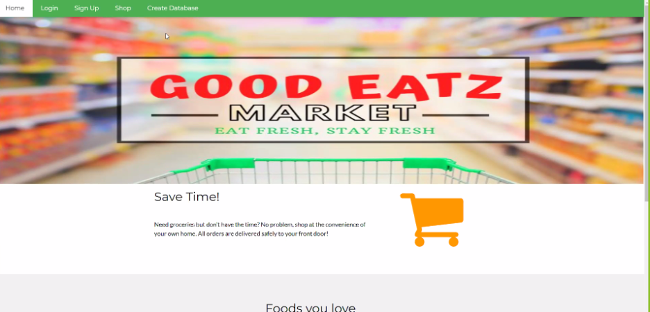
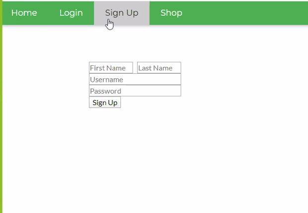
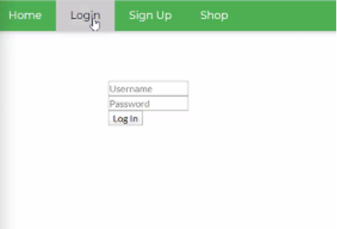
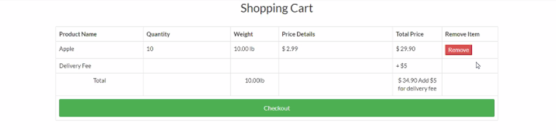
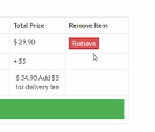
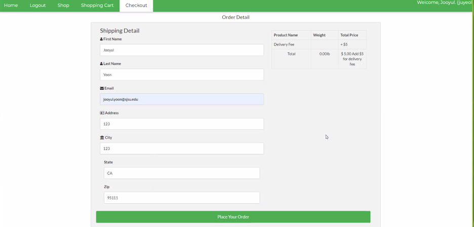

# GOOD EATZ MARKET

## User's Guide

## Project Credits:

- Becerra Lesley
- Prado, Guido
- Walton, Makayla
- Wu, Bailin
- Yan, Yuchao
- Yo, Bolang
- Yoon, Jooyul

# Content

## 1. [General Information]()

- ### 1.1 [Display]()

## 2. [Registration]()

- ### 2.1 [Creating an account]()
- ### 2.2 [Log in]()

## 3. [Shopping]()

- ### 3.1 [Item selection]()

## 4. [General]()

- ### 4.1 [General]()

## 5. [Usage Scenarios]()

## 6 [FAQ]()

# 1. General Information

Welcome to the User Guide for GOOD EATZ MARKET. This user guide is created to provide and answer any questions the user may have about the use of the website. It consists of detailed information about the website for the user. Sections that are included are: “Introduction”, “Registration”, “Shopping”, “Check out”, “Usage Scenarios”, and “Frequently asked questions”.

## 1.1 Display

At first glance, the user sees the webpage. It has a home page, login page, sign up page, and shop page available for the customer. These functions are discussed in detail in the following sections.

# 2. Registration

Upon arriving at our home page, the client has the option to click on “Login” if the client clicks in any other option first, they should be redirected to the login and registration page, which asks for some information from the user to be stored in a database. The user has two options in the Login page, they can register their account or login with their existing account. After registering or login in, the user can go to the shop, shopping cart and checkout page.

## 2.1 Creating an account

- Click on Login from the home page
- Insert user name, email, and password
- Click in “register”
  

## 2.2 Login

- Click in Login from the home page
- Insert the username and password chosen previously
- Click in “login”
- Client is redirected to the home page on their account
  

# 3. Shopping

When the user enters into the shopping page, they will see a selection of items to purchase from the GOOD EATZ MARKET. The user can easily add and take away items from their shopping cart. The following process of selecting items and removing items will be explained in detail in the following sections.

## 3.1 Item selection

### Insert “Shop” Page, Item selection will display on the screen

- Move cursor over the desired item
- Click on the quantity box to change desired quantity of that item
- Once desired quantity entered, click “Add to Cart”

      [Page will automatically refresh and add quantity to the shopping cart]

- Continue shopping and adding items to the cart using steps 1-3

      [Insert “Shopping Cart”]

- Shopping cart will display the quantity and price of the items selected

## 3.2 Item Removal

### Insert “Shop” Page with Shopping Cart Button Circled.

- Move the cursor up to the green bar at the top of the shopping page.
- Right click “Shopping Cart”

### Insert “Shopping Cart” Page with “remove” Button Circled.

- Locate your unwanted Item
- Move your cursor on top of red “Remove” button and right click

### Insert pop up window of amount wished to be deleted

- Move the cursor to the text box and right click.
- Type in the amount of items you wish to remove.
- Move the cursor to the remove box and right click.
  
  

## 4. Checkout

### Insert “Shop” Page with Shopping Cart Button Circled.

\*When finished selecting desired Product.

- Move the cursor up to the green bar at the top of the shopping page.
- Right click the “Shopping Cart option” will bring your shopping cart option

### Insert photo of Filled Shopping Cart

- Scroll down in shopping cart page until you see a Blue Check-out button
- Move Cursor to Check-out button, Right click to check out.
  

### 4.1 Shopping cart

### Insert “Shop” Page with Shopping Cart Button Circled.

- Move the cursor up to the green bar at the top of the shopping page.
- Left click “Shopping Cart”
- Check the item and total price and remove the item
- Left click “checkout” bar
- Entry “shipping detail”
- Complete order by left click ”Place your order”
- Done

## 5. Use Scenarios

- Unregistered user wanting to shop
- User entered wrong address
- User adding too much or too little item into the cart
- User requesting more than store inventory
- User adding a item that is out of stock into shopping cart

## 6. FAQ

### **Q: Can I shop without having an account?**

A: Unfortunately, an account needs to be created. Please refer to section 2 “Registration” in subsection 2.1 “Creating an account” for further assistance.

### **Q: Can I have a refund?**

A: No refunds! All sales are final.

### **Q: Can I return items?**

A: No, we do not accept food that has been purchased because of health and safety concerns.
